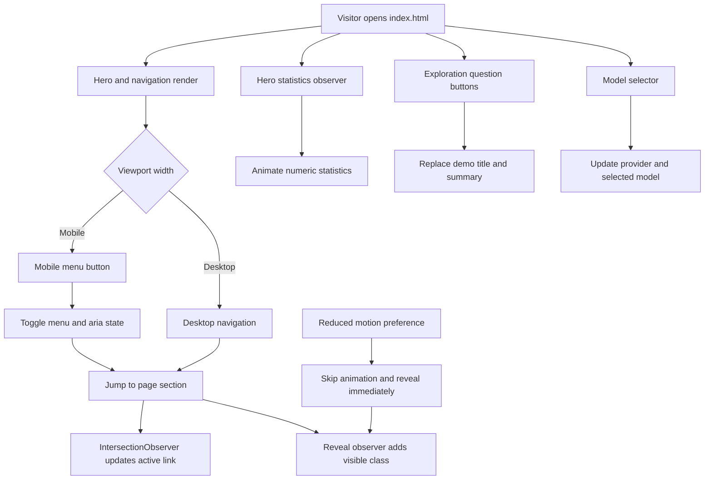

# LunaAI Explorer Landing Page

The official static landing page for **LunaAI Explorer**, a Chrome extension concept that turns highlighted web content into an AI-powered exploration. The page presents the product story, demonstrates the highlight-to-understanding workflow, and links visitors to the extension repository.

This repository contains the landing page only. The Chrome extension runtime, AI requests, model integrations, and browser selection logic live in the separate extension project.

## What This Project Does

The landing page communicates one simple workflow:

1. Highlight a word, phrase, or topic on a webpage.
2. Open the contextual `Explore with LunaAI` action.
3. Start with a summary and continue through questions, key concepts, and related topics.

The page is a front-end demonstration. The question panel and model selector update the local demo UI; they do not make API calls or generate live AI responses.

## Features

- Full-viewport hero with an optional looping background video.
- Responsive desktop and mobile navigation.
- Mobile menu with `aria-expanded`, `aria-hidden`, and Escape-key handling.
- Scroll-aware desktop navigation that marks the visible section as active.
- Product mockup showing a selected topic and contextual explore action.
- Three-step workflow: Highlight, Explore, and Understand.
- Interactive exploration demo with four question buttons and changing summary copy.
- AI model selector demo with provider and model labels.
- Animated hero statistics for provider and model counts.
- Scroll reveal animations using `IntersectionObserver`.
- Reduced-motion behavior using `prefers-reduced-motion`.
- Visible keyboard focus styles for links and buttons.
- Responsive layouts for narrow mobile screens through large desktop screens.

## Live Page Sections

| Section | Anchor | Purpose |
| --- | --- | --- |
| Hero | `#home` | Introduces LunaAI Explorer and links to the extension. |
| Product | `#product` | Shows how selected browser content becomes an exploration. |
| How It Works | `#how-it-works` | Explains the Highlight, Explore, Understand workflow. |
| Exploration Loop | `#explore` | Demonstrates question-driven follow-up learning. |
| Philosophy | None | Presents Summary, Key Concepts, Ask Deeper, and Explore Next. |
| AshnaAI Models | `#models` | Demonstrates switching between AI providers and models. |
| Why LunaAI | None | Lists the product's main benefits. |
| Developer | None | Introduces Tanisha Sharma and the project motivation. |
| Contact | `#contact` | Links to GitHub and LinkedIn. |
| Final CTA | None | Sends visitors to the extension repository or source archive. |

## Interaction Diagram



## Project Structure

```text
LunaAI-Explorer-Landing/
├── index.html                 # Complete page markup and content
├── main.js                    # Navigation and interactive demo behavior
├── styles.css                 # Theme, layout, responsive rules, and animations
├── README.md                  # Project documentation
├── assets/
│   └── logo.webp              # LunaAI Explorer logo
└── fonts/
        └── GeistPixel-Circle.woff2 # Local display font
```

## Technology

- HTML5 for semantic page structure.
- CSS3 for layout, responsive design, visual effects, and animations.
- Plain JavaScript with no framework or bundler.
- `IntersectionObserver` for section state, reveal effects, and statistics.
- Font Awesome 6.5.2 for interface icons.
- Inter and Bubbledot ICG FinePos loaded from external font providers.
- A remote MP4 background video loaded from CloudFront.

There is no `package.json`, build pipeline, environment file, or backend service in this repository.

## Run Locally

### Option 1: Open the file

Open [index.html](index.html) directly in a modern browser. This is enough for reviewing the layout and local interactions.

### Option 2: Use a local static server

Serving the directory is recommended because it more closely matches deployment behavior.

With Node.js installed:

```powershell
npx serve .
```

Or with Python installed:

```powershell
python -m http.server 8000
```

Then visit `http://localhost:8000` or the URL printed by the server.

## JavaScript Behavior

All runtime behavior is in [main.js](main.js):

- The mobile menu opens and closes through `.menu-toggle` and `.mobile-menu`.
- Clicking a mobile menu link closes the menu.
- Pressing Escape closes the mobile menu.
- Resizing above 720 pixels closes the mobile menu.
- The active desktop navigation item follows the visible page section.
- Elements with `.reveal` receive `.visible` as they enter the viewport.
- Elements with `data-stat="12"` or `data-stat="60"` count up when the hero stats enter view.
- Question buttons use `data-title` and `data-copy` to update `#demo-title` and `#demo-copy`.
- Model buttons use `data-provider` and `data-model` to update the current model display.
- Clicking outside the model selector closes its options list.

## Customization Guide

### Content and links

Edit [index.html](index.html) to change headings, descriptions, navigation labels, social links, extension links, question data, and model options.

Question buttons follow this pattern:

```html
<button
    data-title="New summary title"
    data-copy="New explanation text.">
    ASK A NEW QUESTION
</button>
```

Model options follow this pattern:

```html
<button
    role="option"
    data-provider="PROVIDER"
    data-model="Model name">
    Model name
</button>
```

### Styling

Edit [styles.css](styles.css) for colors, typography, spacing, breakpoints, section layouts, reveal transitions, and hero treatment. The primary theme values are defined near the top in `:root`.

### Assets

- Replace [assets/logo.webp](assets/logo.webp) to update the logo.
- Replace the `<source>` URL in [index.html](index.html) to use another hero video.
- Keep a fallback background color in `.bg` so the hero remains usable when video loading fails.
- Keep the local font path in `@font-face` valid if the font file is replaced.

## External Resources and Offline Behavior

The page references these remote resources:

- Google Fonts: Inter.
- OnlineWebFonts: Bubbledot ICG FinePos.
- cdnjs: Font Awesome 6.5.2 and its integrity hash.
- CloudFront: hero background video.

An internet connection is required for those resources. Without network access, the page still renders with CSS fallback fonts, the local logo, the local display font, and the hero background color. Icons and the video may be unavailable.

## Accessibility Notes

- The document declares `lang="en"` and includes a viewport definition.
- The page uses landmarks such as `header`, `nav`, `main`, `section`, and `footer`.
- Navigation and interactive elements have labels or visible text.
- The mobile menu exposes its open state through ARIA attributes.
- The model selector uses `role="listbox"` and `role="option"`.
- The hero video is muted, loops, and uses `playsinline`; it is decorative and does not carry essential content.
- `prefers-reduced-motion: reduce` disables the main reveal and count-up animations.
- Keyboard focus is visible on links and buttons.

## Validation

Check JavaScript syntax with Node.js:

```powershell
node --check main.js
```

For a manual smoke test, verify the following in a browser:

1. Open and close the mobile menu, including with Escape.
2. Scroll through the page and confirm the active desktop nav item changes.
3. Click each exploration question and confirm the summary changes.
4. Open the model selector and choose several models.
5. Resize the browser across the 720 pixel breakpoint.
6. Enable reduced motion in the operating system or browser and reload.
7. Test the page with the remote resources blocked to confirm the fallback layout.

## Deployment

Deploy the complete directory to any static host, including GitHub Pages, Netlify, Vercel, Cloudflare Pages, or an ordinary web server. No compilation or environment variables are required. Preserve the relative `assets/` and `fonts/` directories when uploading.

## Related Project

The primary extension link used by the page is:

`https://github.com/Priyanshu84iya/LunaAI-Explorer-extension`

The landing page itself links to the developer's GitHub profile and LinkedIn profile from the contact and footer areas.

## License

No license has been specified for this project.
